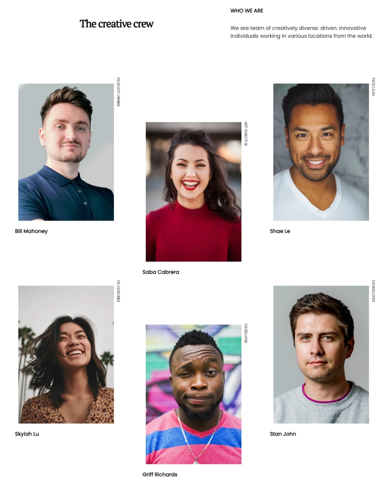

<!-- Please update value in the {}  -->

<h1 align="center">{The creative crew}</h1>

   Solution for a challenge from  <a href="http://devchallenges.io" target="_blank">Devchallenges.io</a>.

  <h3>
    <a href="https://snazzy-biscochitos-cc6c4b.netlify.app/">
      Demo
    </a>
     | 
    <a href="https://github.com/im-victor-mendez/CSS-My_Team_Page">
      Solution (GitHub)
    </a>
     | 
    <a href="https://devchallenges.io/challenges/hhmesazsqgKXrTkYkt0U">
      Challenge
    </a>
  </h3>

<!-- TABLE OF CONTENTS -->

## Table of Contents

- [Overview](#overview)
  - [Built With](#built-with)
- [Features](#features)
- [My Proyects](#my-projects)

<!-- OVERVIEW -->

## Overview

- Where can I see your demo?
  - In [Netlify](https://snazzy-biscochitos-cc6c4b.netlify.app/)
- What was your experience?
  - A little difficult with CSS, I think I'm improving my fluency.
    But I'm taking a litte long time :( 
- What have you learned/improved?
  - Improve display/layout in CSS.

### Built With

- [HTML]
- [CSS]
- [VSCode]
- [Github](https://github.com/im-victor-mendez/CSS-My_Team_Page.git)

## Features

<!-- List the features of your application or follow the template. Don't share the figma file here :) -->

This application/site was created as a submission to a [DevChallenges](https://devchallenges.io/challenges) challenge. The [challenge](https://devchallenges.io/challenges/hhmesazsqgKXrTkYkt0U) was to build an application to complete the given user stories.

## My projects

- GitHub [im-victor-mendez](https://github.com/im-victor-mendez)
- Codepen [im-victor-mendez](https://codepen.io/im-victor-mendez)
